<div align="center">

# ⚡ Snappy Switcher

### A blazing-fast, animated Alt+Tab window switcher for Hyprland

[](LICENSE)
[](https://en.cppreference.com/w/c)
[](https://hyprland.org/)
[]()

<br/>


<br/>

*The window switcher that actually understands your workflow.*

</div>

---

## ✨ Why Snappy Switcher?

**Snappy Switcher** isn't just another window list—it's a **context-aware** window manager that thinks like you do:

| Feature | Description |
|---------|-------------|
| 🧠 **Context Grouping** | Automatically groups tiled windows by workspace + app class. Your 5 terminal windows become one clean card. |
| 🎨 **12 Themed Skins** | Ships with Catppuccin, Dracula, Nord, Tokyo Night, and more. Full `.ini` customization. |
| ⚡ **Native Performance** | Pure C with Wayland Layer Shell. No Electron. No lag. |
| 🔄 **Crash Recovery** | Socket takeover protocol ensures seamless recovery if the daemon restarts. |
| 🖼️ **Polished Visuals** | Animated selection, drop shadows, rounded corners, and app badges—all Cairo-rendered. |

---

## 🔄 How It Works

```mermaid
flowchart LR
    subgraph Input[" "]
        A["⌨️ Alt+Tab"]
    end

    subgraph Daemon["🔧 Snappy Daemon"]
        B["📡 Fetch Clients<br/>(Hyprland IPC)"]
        C["📊 Sort by MRU<br/>(Most Recently Used)"]
        D["🧩 Context Aggregation<br/>(Group Tiled Windows)"]
    end

    subgraph Output[" "]
        E["🖼️ Cairo Render"]
        F["👁️ Overlay Display"]
    end

    A --> B --> C --> D --> E --> F

    style A fill:#89b4fa,stroke:#1e1e2e,color:#1e1e2e
    style B fill:#a6e3a1,stroke:#1e1e2e,color:#1e1e2e
    style C fill:#fab387,stroke:#1e1e2e,color:#1e1e2e
    style D fill:#f9e2af,stroke:#1e1e2e,color:#1e1e2e
    style E fill:#cba6f7,stroke:#1e1e2e,color:#1e1e2e
    style F fill:#f38ba8,stroke:#1e1e2e,color:#1e1e2e
```



### 🔍 Context Mode in Action

```mermaid
graph TB
    subgraph Before["📋 Raw Window List"]
        W1["kitty<br/>workspace 1"]
        W2["kitty<br/>workspace 1"]
        W3["firefox<br/>workspace 2"]
        W4["kitty<br/>workspace 1"]
        W5["firefox<br/>floating"]
    end

    subgraph After["✨ After Context Aggregation"]
        G1["🔲 kitty × 3<br/>workspace 1"]
        G2["🔲 firefox<br/>workspace 2"]
        G3["🔳 firefox<br/>floating"]
    end

    Before -->|"Group Tiled<br/>Preserve Floating"| After

    style G1 fill:#313244,stroke:#89b4fa,color:#cdd6f4
    style G2 fill:#313244,stroke:#89b4fa,color:#cdd6f4
    style G3 fill:#45475a,stroke:#f38ba8,color:#cdd6f4
```



> 💡 **Floating windows** are always shown individually—they're special!

---

## 📦 Installation

### Arch Linux (Recommended)

```bash
git clone https://github.com/OpalAayan/snappy-switcher.git
cd snappy-switcher
makepkg -si
```

### Manual Build

<details>
<summary>📋 <b>Dependencies</b></summary>

| Package | Purpose |
|---------|---------|
| `wayland` | Core protocol |
| `cairo` | 2D rendering |
| `pango` | Text layout |
| `json-c` | IPC parsing |
| `libxkbcommon` | Keyboard handling |
| `glib2` | Utilities |
| `librsvg` | SVG icons *(optional)* |

</details>

```bash
# Build
make

# Install system-wide
sudo make install

# Or install for current user only
make install-user
```

---

## 🚀 Quick Start

### 1️⃣ Setup Configuration

```bash
snappy-install-config
```

This copies themes and creates `~/.config/snappy-switcher/config.ini`.

### 2️⃣ Add to Hyprland Config

Add these lines to `~/.config/hypr/hyprland.conf`:

```bash
# Start the daemon on login
exec-once = snappy-switcher --daemon

# Keybindings
bind = ALT, Tab, exec, snappy-switcher next
bind = ALT SHIFT, Tab, exec, snappy-switcher prev
```

### 3️⃣ You're Done! 🎉

Press <kbd>Alt</kbd> + <kbd>Tab</kbd> to see it in action.

---

## 🎨 Theme Gallery

> All 12 themes included out of the box. Just change one line in your config!

<table>
<tr>
<td align="center">
<br/>
<b>Snappy Slate</b><br/><sub>Default</sub>
</td>
<td align="center">
<br/>
<b>Catppuccin Mocha</b>
</td>
<td align="center">
<br/>
<b>Catppuccin Latte</b>
</td>
</tr>
<tr>
<td align="center">
<br/>
<b>Tokyo Night</b>
</td>
<td align="center">
<br/>
<b>Nord</b>
</td>
<td align="center">
<br/>
<b>Nordic</b>
</td>
</tr>
<tr>
<td align="center">
<br/>
<b>Dracula</b>
</td>
<td align="center">
<br/>
<b>Gruvbox Dark</b>
</td>
<td align="center">
<br/>
<b>Rosé Pine</b>
</td>
</tr>
<tr>
<td align="center">
<br/>
<b>Cyberpunk</b>
</td>
<td align="center">
<br/>
<b>Grovestorm</b>
</td>
<td align="center">
<br/>
<b>Default Fallback</b>
</td>
</tr>
</table>

### 🎯 Change Theme

Edit `~/.config/snappy-switcher/config.ini`:

```ini
[theme]
name = catppuccin-mocha.ini
```

---

## ⚙️ Configuration

<details>
<summary>🔧 <b>Full Configuration Reference</b></summary>

```ini
# ~/.config/snappy-switcher/config.ini

[general]
# overview = Show all windows individually
# context  = Group tiled windows by workspace + app class
mode = context

[theme]
name = snappy-slate.ini
border_width = 2
corner_radius = 12

[layout]
card_width = 160
card_height = 140
card_gap = 10
padding = 20
max_cols = 5
icon_size = 56

[icons]
theme = Tela-dracula
fallback = hicolor
show_letter_fallback = true

[font]
family = Sans
weight = Bold
title_size = 10
```

</details>

📘 **[Full Configuration Documentation →](docs/CONFIGURATION.md)**

---

## 🏗️ Architecture

```mermaid
flowchart TB
    subgraph Client["📱 Client Commands"]
        CMD["snappy-switcher next/prev"]
    end

    subgraph Daemon["🔧 Daemon Process"]
        SOCK["🔌 Unix Socket<br/>/tmp/snappy-switcher.sock"]
        
        subgraph Core["Core Logic"]
            HYP["hyprland.c<br/>IPC + Window Fetch"]
            CFG["config.c<br/>INI Parsing"]
            ICO["icons.c<br/>Theme Resolution"]
        end
        
        subgraph Render["Rendering"]
            RND["render.c<br/>Cairo + Pango"]
            INP["input.c<br/>Keyboard Events"]
        end
        
        WL["🌊 Wayland<br/>Layer Shell"]
    end

    subgraph External["🌐 External"]
        HYP_IPC["Hyprland IPC"]
        DISP["Display Server"]
    end

    CMD -->|"send command"| SOCK
    SOCK --> HYP
    HYP <-->|"j/clients"| HYP_IPC
    CFG --> RND
    ICO --> RND
    HYP --> RND
    RND --> WL
    INP --> WL
    WL <--> DISP

    style SOCK fill:#89b4fa,stroke:#1e1e2e,color:#1e1e2e
    style HYP fill:#a6e3a1,stroke:#1e1e2e,color:#1e1e2e
    style RND fill:#cba6f7,stroke:#1e1e2e,color:#1e1e2e
    style WL fill:#f9e2af,stroke:#1e1e2e,color:#1e1e2e
```



### 📁 Key Components

| File | Purpose |
|------|---------|
| `main.c` | Daemon, event loop, socket server |
| `hyprland.c` | IPC client, window parsing, context aggregation |
| `render.c` | Cairo/Pango rendering, card drawing |
| `config.c` | INI parser, theme loading |
| `icons.c` | Icon theme resolution (XDG compliant) |
| `input.c` | Keyboard handling via libxkbcommon |
| `socket.c` | Unix socket IPC |

📘 **[Full Architecture Documentation →](docs/ARCHITECTURE.md)**

---

## 🧪 Available Commands

| Command | Description |
|---------|-------------|
| `snappy-switcher --daemon` | Start background daemon |
| `snappy-switcher next` | Cycle to next window |
| `snappy-switcher prev` | Cycle to previous window |
| `snappy-switcher toggle` | Show/hide switcher |
| `snappy-switcher hide` | Force hide overlay |
| `snappy-switcher select` | Confirm current selection |
| `snappy-switcher quit` | Stop the daemon |

---

## 🤝 Contributing

Contributions are welcome! Here's how to get started:

```bash
# Clone the repo
git clone https://github.com/OpalAayan/snappy-switcher.git
cd snappy-switcher

# Build
make

# Run tests
make test

# Clean build
make clean && make

# Run stress tests
./scripts/ultimate_stress_test.sh
```

---

## 💡 Credits & Inspiration

This project was built with ❤️ for the Linux customization community.

| Project | Contribution |
|---------|--------------|
| **[hyprshell](https://github.com/H3rmt/hyprshell)** | Massive inspiration for client parsing and layer-shell handling |
| **[Hyprland](https://hyprland.org/)** | The incredible compositor that makes this possible |
| **[Catppuccin](https://github.com/catppuccin)** | Beautiful color palettes used in themes |

---

<div align="center">

### ⚡ Made with love by [Opal Aayan](mailto:YougurtMyFace@proton.me)

[](https://github.com/OpalAayan/snappy-switcher)

<sub>Licensed under GPL-3.0</sub>

</div>
